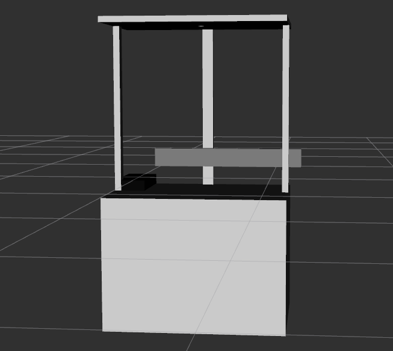
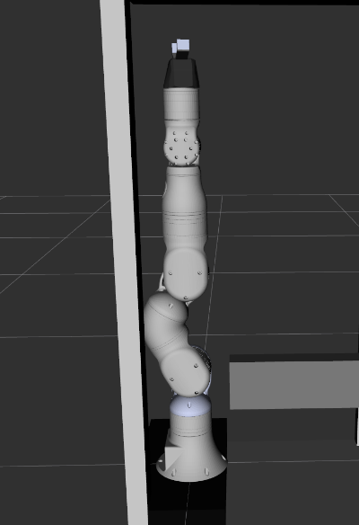
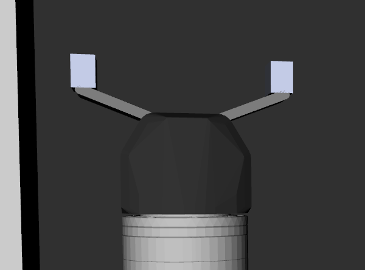
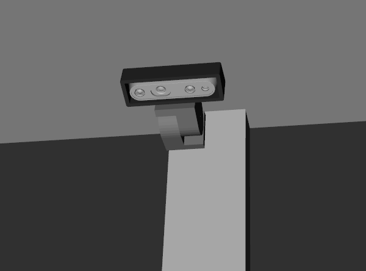
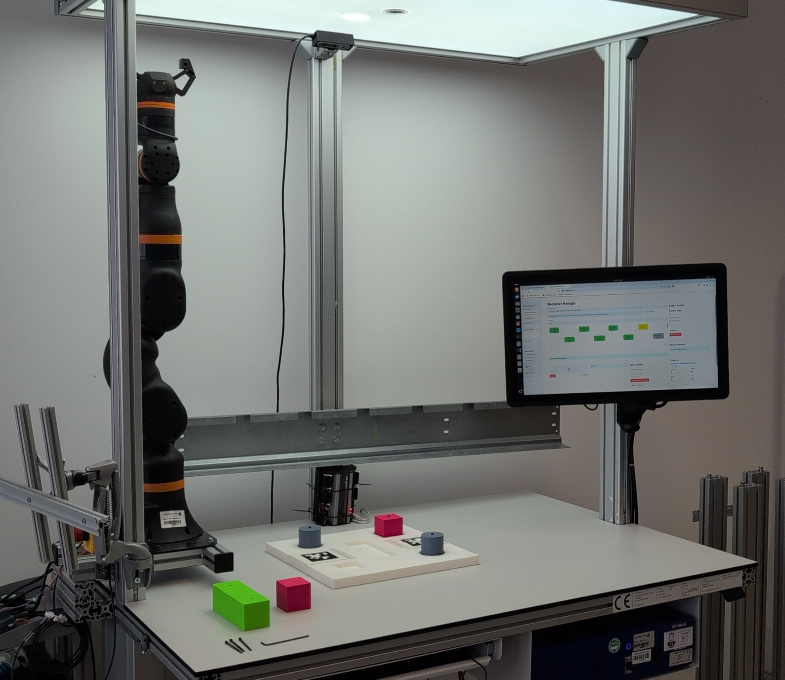
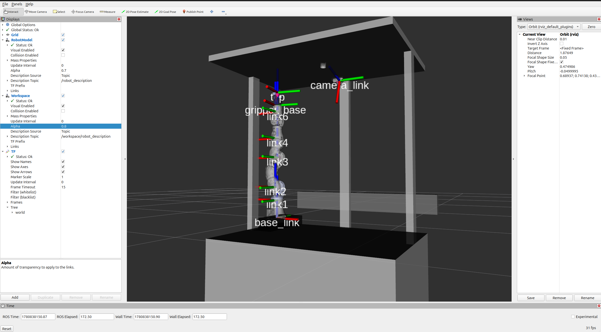

# kls_description

Robot and workspace description for Klaus project (igus ReBeL 6-DOF arm).

| **`Workspace`**                                     | **`Robot Arm (IGUS Rebel 6-DOF)`**            | **`Gripper (IGUS Rebel Gripper)`**                    | **`Camera (Intel Realsense D435)`**                   |
| --------------------------------------------------- | --------------------------------------------- | ----------------------------------------------------- | ----------------------------------------------------- |
|  |  |  |  |


## Overview

This package provides URDF models and visualization configurations for the Klaus robot system, including:
- **Robot arm**: igus ReBeL 6-DOF manipulator
- **Gripper options**: None or ReBeL gripper
- **Camera**: Intel Realsense D435 (optional)
- **Workspace**: Table and environment visualization

## Contents

- [`urdf/`](urdf/) - Robot and workspace URDF models
- [`meshes/`](meshes/) - Collision and visual meshes
- [`launch/`](launch/) - Visualization launch files
- [`rviz/`](rviz/) - RViz configurations

## Build

```bash
colcon build --packages-select kls_description
```

## Quick Start

Visualize robot and Workspace (without gripper):
```bash
ros2 launch kls_description view_kls.launch.py
```

Visualize robot and Workspace (with gripper):
```bash
ros2 launch kls_description view_kls.launch.py gripper_type:=rebel
```

**With camera** (recommended tilt: -17°):
```bash
ros2 launch kls_description view_kls.launch.py \
  gripper_type:=rebel \
  use_camera:=true \
  camera_tilt_degrees:=-17
```

**Workspace only**:
```bash
ros2 launch kls_description view_workspace.launch.py
```

## Arguments

### view_kls.launch.py
- `gripper_type`: `none` (default), `rebel`
- `use_camera`: `true`/`false` (default: `false`)
- `camera_tilt_degrees`: Tilt angle in degrees (default: 0.0)

### view_workspace.launch.py
No arguments (workspace only visualization)


## Visualization

In the real and modeled workspacee below the following elements are present:

 - Workspace Table
 - IGUS ReBeL Arm
 - ReBeL Gripper
 - Realsense D435 Camera


| **`Real Workspace Environment`**    | **`Modelled Workspace Environment`**   |
| ----------------------------------- | -------------------------------------- |
|  |  |


### Articulation of Robot Arm in Workspace

https://github.com/user-attachments/assets/645409ca-f4be-4406-9919-07d2d0be212f
